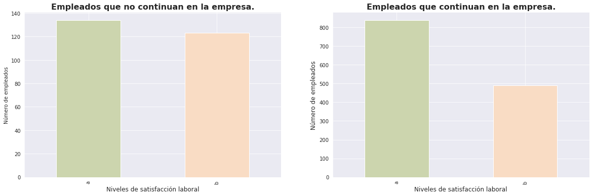
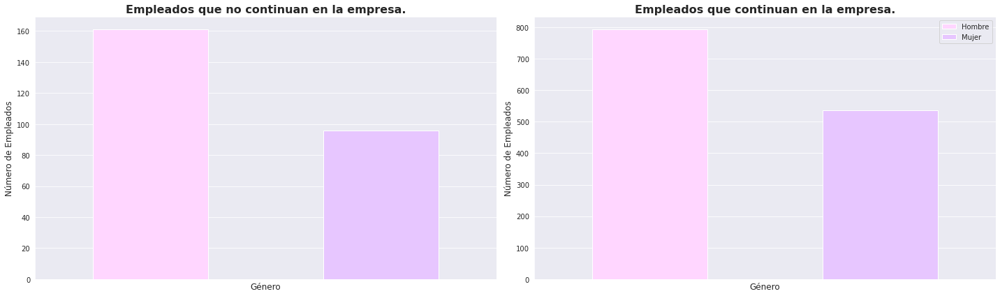
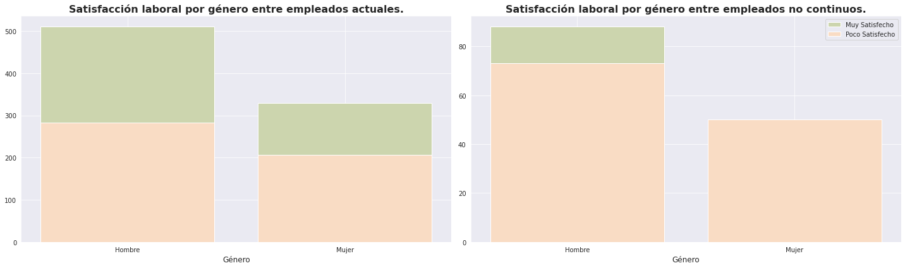
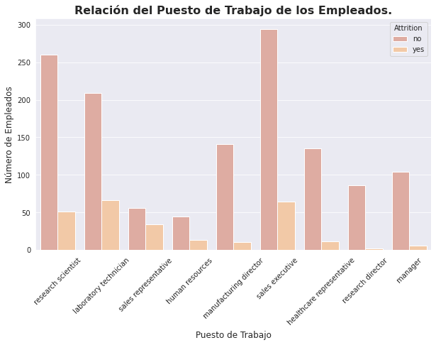
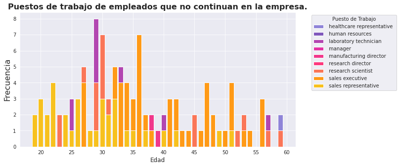
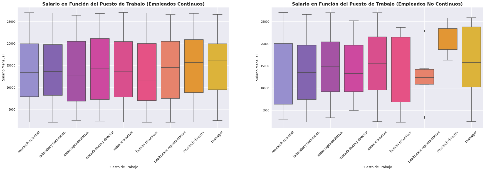
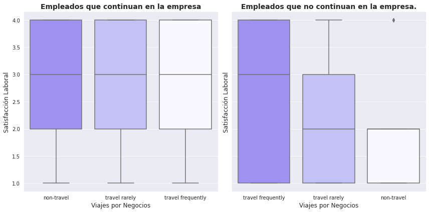
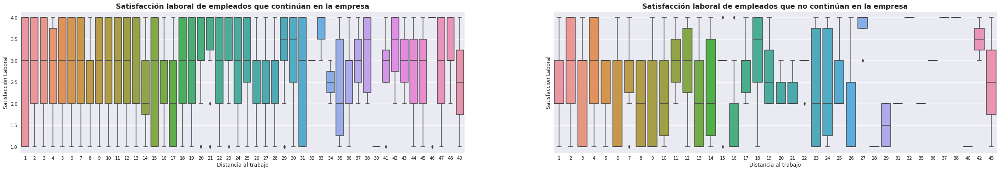
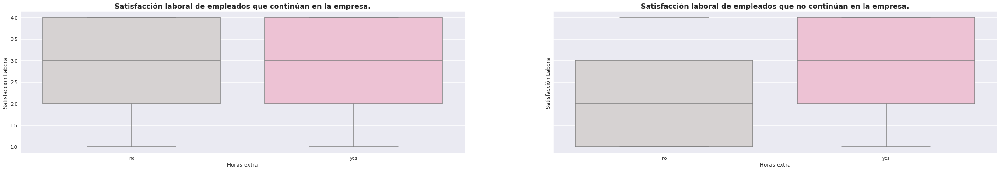

# Enola's Data resultados

## Características de los empleados de la empresa ABC corporation. 

1. Representación de la edad de los empleados clasificada en grupos de edad.
    - Nacimientos hasta 1980. Generación X
    - Nacimientos postariores a 1980. Generación millenial

    

    - Podemos decir que la empresa ABC corporation está formada por empleados jóvenes.

2. Representación de los empelados en función de su continuidad en la empresa.

    

    - Como observamos un 16.2% ha abandonado ABC corporation.

3. Representación de los empleados en función de su género.

    

    - El equipo de trabajoo está formado por más hombres que mujeres

## Hipótesis para identificar el motivo del abandono.

1.  H0: No hay relación entre los grupos de edad y la continuidad. \
        H1: La edad de los empleados influye en su continuidad.

    

    En la gráfica se puede apreciar que la distribución por grupos de edad no ha variado significativamente. Los millenials se incrementan un 8% entre lo que continuan y la generación X disminuye en la misma proporción.

2. H0: No hay relación entre la satisfacción y la continuidad en la empresa. \
    H1: La satisfacción de los empleados influye en su continuidad

    
        
    Independientemente de su continuidad, los empleados tienden a estar satisfechos en ABC corporation.

    A continuación, generamos dos grupos con niveles de satisfacción, en el nivel A vamos a encontrar aquellos empleados con una satisfacción elevada frente al grupo B que cuentan con niveles de satisfacción más bajos

    

    Como podemos observar, el nivel de satisfacción no es determinante, una vez más vemos que los empleados que no continuan estaban satisfechos.

    

    Para acabar de validar nuestra hipótesis, agregamos a la ecuación los grupos de edad. 
    Según nuestro  análisis, parece que los empleados pertenecientes a la generación X que han decidido dejar la empresa tenían niveles de satisfacción más bajos en comparación con los pertenecientes a la generación millennial. Esto sugiere que la edad  junto con el nivel de satisfacción puede ser un factor importante en la decisión de abandonar la empresa, especialmente en edades más avanzadas.

    De todos los empleados que permanecen en la organización continuamos viendo que los pertenecientes a edades más avanzadas siguen siendo los menos satisfechos y por otro lado, que la insatisfacción de los millenials se ha reducido.

3. H0: No hay relación entre la satisfacción laboral y el género y por tanto no es determinante para la continuidad en la empresa./
    
    H1: El género influye en la satisfacción laboral y por tanto, en la continuidad en la empresa.

    

    

    

    Como podemos ver, el genero no influye en la satisfacción en la satisfacción pero si en la continuidad, las mujeres satisfechas no abandonan el proyecto pero, los hombres, aunque estén satisfechos si lo hacen.

4. H0: El rol no influye en la continuidad en la empresa./ 
    H1: El rol determina la continuidad.

    
    
Como podemos ver, en los puestos con más reponsabilidad hay menos rotación que aquellos con menos responsabilida por tanto, podríamos decir que el rol influye en la continuidad en la empresa.

Siguiendo con esta hipótesis, en el gráfico se observan las categorías que ostentan aquellos empleados que continuan en la empresa. Los puestos con mayor responsabilidad están ocupados por personal de la generación X frente a los millenials que ocupan mandos intermedios.

5. H0: El salario no influye en la continuidad en la empresa/
H1: El salario determina la continuidad en la empresa.

Como podemos ver en el gráfico, el salario si influye en la continuidad en la empresa. Podemos decir que los empleados con un salario más bajo en su puesto de trabajo ha decidido no seguir en la empresa.

6. H0: Los viajes no influyen en la continuidad en la empresa/
H1: Los empleados que viajan frecuentemente están menos satisfechos.

Como vemos, los empleados que más viajaban eran los que menos satisfacción tenían por tanto este factor si impacta en la continuidad. Actualmente vemos que todos los empleados que viajan estan igual de satisfechos que aquellos que no lo hacen.

7. H0: No existe relación entre la distancia al trabajo y la continuidad en la empresa/
H1: Los empleados con más distancia al trabajo no continuan en la empresa.

La distancia al trabajo es un factor importante en la continuidad. aquellos empleados que vivían más lejos del trabajo ya no forman parte de la plantilla.

8. H0: No existe relación entre la continuidad en la empresa y las horas extra./
H1: Los empleados que hacen horas extras no continuan en la empresa

La satisfacción laboral y continuidad del empleado si están condicionadas por las horas extras, aquellos que no hacían horas extras estaban menos satisfechos que los que sí las hacían